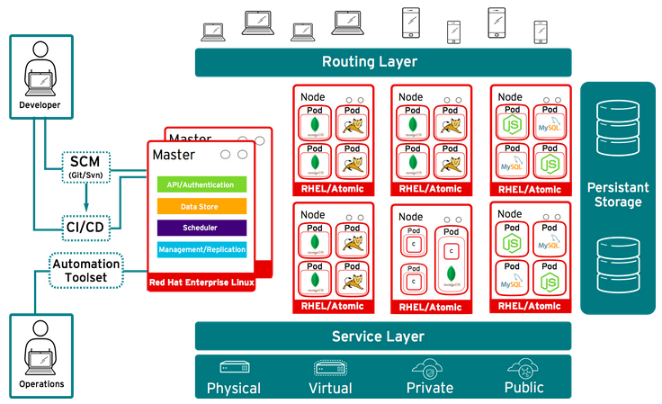

# Pizza Session - Polaris Demo

# Intro

During this demo session we are going to show you the key elements of what
we think a managed container platform should provide by deploying a demo
application within OpenShift:

- self Service Platform
- decreased time to market
- CI/CD
- increased availability
- scalability and elasticity
- PaaS/CaaS


# Lets get dirty, hands-On

## Everything is code

Everything starts with a code repository nowadays. So let's walk briefly through
the code of this demo application.

[Browse me](catch-them-all)


## Creating a Project

> Open up a tmux session with splitted panes `Ctrl-a "`
> switching between panes using `Ctrl-a o`

* login using your web browser: [API server](https://ose-master-api.linux.rabobank.nl:8443) and via the command line:

```shell
oc login
```

* Create the project:

```shell
oc new-project [project name]
```

For this demo, our application needs to be able to retrieve info from the [API server](https://ose-master-api.linux.rabobank.nl:8443).
Below commands gives us (the project) the nescessary rights:

```shell
oc policy add-role-to-user view system:serviceaccount:$(oc project -q):default -n $(oc project -q)
```

>  For monitoring the creation of the pods, monitor the pods in the top pane: `oc get pods -show-all=false --watch`

top screen:

```shell
oc get pods --show-all=false --watch
```

## Deploying the application (workaround; using a build secret)

Dissable git ssl verification:

```shell
cd; git config -f .gitconfig http.sslVerify "false"
```


Indirecty create the ojbect definitions based on the remote source repo:

```shell
oc new-app https://git.eu.rabonet.com/polaris/pizza-session.git --context-dir=catch-them-all -o yaml > objects.yaml
```
> Note: above command makes use of the new-app macro. But instead of creating all the objects (buildconfig, deploymentconfig, services), the object definition is ouputted and saved into a file.

create a secret containing the git config and attach it to the buildconfig:

```shell
oc secrets new gitconfig .gitconfig=.gitconfig
```

```shell
sed -i '/secrets:/i \ \ \ \ \ \ sourceSecret:\n\ \ \ \ \ \ \ \ name: gitconfig' objects.yaml
```

and finally, create the objects:

```shell
oc create -f objects.yaml
```

## Deploying the application directly from a git source (original)

```shell
oc new-app https://git.eu.rabonet.com/polaris/pizza-session.git --context-dir=catch-them-all
```

> Note: above command makes use of the integrated [s2i](https://docs.openshift.com/enterprise/3.2/architecture/core_concepts/builds_and_image_streams.html#source-build) functionality

## Monitoring of the buid Process and exposing the application

follow the build in the bottom screen: `oc logs -f $(oc get bc -o name)` and wait untill the build has finished..

The application(pod) has been deployed and is now running somewhere in our cluster. Reachable via a service.

```shell
oc get svc
```

To be able to connect from the outside world to the application, you need to expose the service to the outside world (create a route):

```shell
oc get routes
oc expose svc [service name] 
```

show the created route:

```shell
oc get routes
```

browse to the above created route.

# Making some ripples

In this part we are going to focuss on the availability and elasticity:

* ephemeral containers
* failure recovery
* scaling

Before we do this though, we need to mention the concept of a *replication controller*. From [Kubernetes manual](http://kubernetes.io/docs/user-guide/replication-controller/):

> A replication controller ensures that a specified number of pod replicas are running at any one time. In other words, a
> replication controller makes sure that a pod or homogeneous set of pods are always up and available. If there are too many
> pods, it will kill some. If there are too few, the replication controller will start more. Unlike manually created pods, the
> pods maintained by a replication controller are automatically replaced if they fail, get deleted, or are terminated. For example
> your pods get re-created on a node after disruptive maintenance such as a kernel upgrade. For this reason, we recommend that
> you use a replication controller even if your application requires only a single pod. You can think of a replication controller
> as something similar to a process supervisor, but rather than individual processes on a single node, the replication controller
> supervises multiple pods across multiple nodes.

## Ephemeral containers

login to one pod:

```shell
oc rsh [pod name]
```

and delete the images

```shell
cd /opt/app-root/src/pokemon
rm -rf *.png
```

## Failure Recovery

delete the pod that we modified in above chapter:

```shell
oc delete pod [pod name]
```


Watch the removal f the instance in the application and creation of a new
pod in the terminal.

## Scaling

show the replication controllers:

```shell
oc get rc
```

To scale the application on the fly, you scale the  *replication controller* :

```shell
oc scale --replicas=[nr] replicationcontrollers [replication controller]
```

> NOTE: above scaling is temporarely. To make it permanent you need to edit/scale the *deployyment config*.

## Probes

Show running application: pizza-session.
Make application fail without killing the pod/container:
```shell
oc get pods
oc rsh [pod-name]
rm -r static/ash.png
```

Show that application is now missing a picture.

Explain the concept of health checks in OpenShift via: [OpenShift health checks](https://docs.openshift.com/enterprise/3.0/dev_guide/application_health.html).
Mention at least readiness and liveness probe.
3 types: tcp port, script in container and url.

Show application source code [healthz check](https://git.eu.rabonet.com/polaris/pizza-session/blob/master/catch-them-all/init.js).
Healthz checks the existens of ash.png else it return 500.

Implement the liveness probe. Edit the deployment configuration:
```shell
oc get dc
oc edit dc [dc-name]
```

Edit stanza: template.spec.containers.livenessprobe
```
livenessProbe:
	failureThreshold: 3
	httpGet:
		path: /healthz
		port: 8080
		scheme: HTTP
	periodSeconds: 10
	successThreshold: 1
	timeoutSeconds: 1
```

Make sure the application is running healthy again. Change in the deployment configuration will automaticly redeploy the application:
Make the application "unhealthy":
```shell
oc rhs [pod-name]
rm static/ash.png
```

Show the result of the livenessProbe.
Unhealthy pod will be restarted.
Get the status of the pod and mention:
 * Restart Count
 * Last State
 * Events: Killing container...
```shell
oc describe pod [pod-name] 
```

Show a readinessProbe.
First scale the application up via the GUI. Mention that a container is created and gets the state: Running

Edit the deployment configuration of the app:
```shell
oc edit dc [dc name]
```

Add a readinessProbe in the deployment configuration of the project.
Edit stanza: template.spec.containers.readinessprobe
```shell
readinessProbe:
            httpGet:
              path: /healthz
              port: 8080
              scheme: HTTP
```

Now scale the application up. Notice the new state Not Ready.

# Automated the build / deploy process

Show the integration of version control repo being updated and starting a
new build/deployment within OpenShift.

## Rollbacks

The deployment config keeps track of image versions. TO rollback to an older deployment, you can perform a rollback
of the deployment config.

get dc:

```shell
oc get dc
```

rollback:

```shell
oc rollback [deployment config]
oc logs -f $(oc get dc -o name)
```

# Additional Information

## OpenShift Architecture

# OpenShift

RedHat's Kubernetes

Below picture gives an overview of the OpenShift architecture showing:

- Master(s)
- Nodes, including pods running on them
- Service layer
- Routing layer




## Links
For more info about the Polaris Project or OpenShift see below links.

* [Polaris Blog](https://confluence.dev.rabobank.nl/pages/viewrecentblogposts.action?key=POL)
* [Polaris OpenShift Pilot Instructions](https://confluence.dev.rabobank.nl/display/POL/OpenShift+Pilot+Instructions)
* [docs.openshift.com](http://docs.openshift.com)
